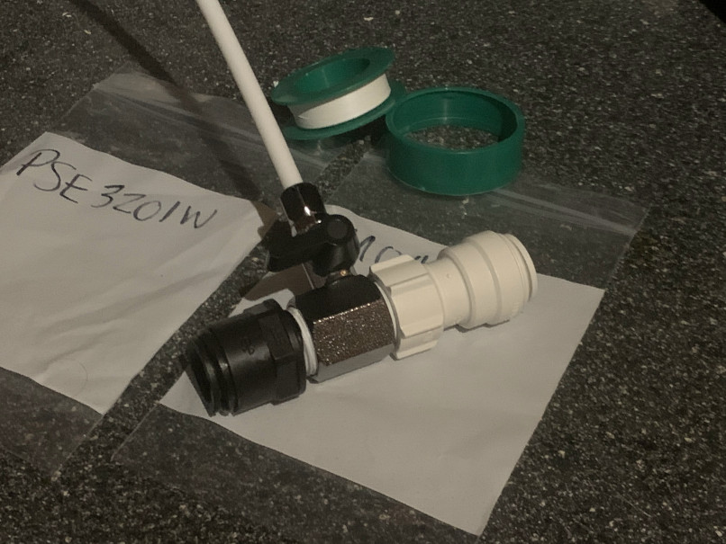

## Installing Daewoo DWD-35MCRCR Washer/Dryer combo

Will finally be able to wash my clothes and sheets/towels aboard.
Powered by my Victron 1200W 230VAC inverter.
100W for cold water wash, 1500W for hot.
I guess, the best I can do, is simply avoid using the hot water mode (warm should fall somewhere in between 100 and 1500 Watts).

Four holes for mounting:

- 30cm apart vertically,
- 42cm apart horizontally on the bottom,
    - 44cm apart on the top (long story short, the top-left screw is 2cm to the left off, kinda messed up).

The overall width of the machine is 55cm, at 65cm tall.

Anchor screws are 3/8-16 (~9mm in diameter), 150mm long.
I’ll be using basic 3/8 drill bit for this.
Will mount using titanium screws later, just because I hate corrosion.

Here’s a [very good YouTube video explaining the installation procedure](https://www.youtube.com/watch?v=tKBRxBntaYg).

It boils down to:

1. Unscrew two little screws, remove the face cover of the machine
1. Connect the tiny water intake hose
1. Attach the discharge (drain) hose
1. Drill holes in the wall
1. Put anchors screws into the wall
1. Mount the machine, tighten the nuts
1. Put the face cover back on

### Connecting to boat’s water supply

My plumbing is poly tube, connectors seem to be twist & lock.
Daewoo has included a threaded male to female metal coupler with a valve that has the little teflon water input hose "leeching" from it.
This means I have to identify the thread, measure the diameter of my poly tube, get one twist & lock male, one twist & lock female, and put everything together.

#### Poly tube

The outer diameter appears to be exactly 15mm.
Could be 5/8" (15.875mm), but it really seems to be 15... the boat is Canadian, after all.

#### Metal coupler

It could be 3/4", but the thing is made in/for Korea, often used in Australia, hence it’s probably something else.
The sealing gasket measures 18.5mm outer diameter, 3mm thick, 11.3mm inner hole diameter.
[This item that has similar measurements](https://www.thunderfix.co.uk/products/washer-for-1-2-bsp-flexible-tap-connectors-19mm-diameter-pack-of-5) makes me think the fitting is 1/2" BSP.

The outer diameter of the male side is 20.56mm,
the inner diameter of the female side is 18.86mm,
and the inner diameter of the coupler itself is 13.3mm.
The little metal coupler with a valve that goes into the big metal coupler has thread closest to M10.
My suspicion is that the big coupler is 1/2" BSP, and the little one is 1/8" BSP.

Looks like [John Guest Female Connector BSP - 15mm x 1/2 BSP](https://www.freshwatersystems.com/products/john-guest-female-connector-bsp-15mm-x-1-2-bsp) will do for one side,
[John Guest Male Connector BLACK ACETAL - 15mm x 1/2 BSP](https://www.freshwatersystems.com/products/john-guest-male-connector-black-acetal-15mm-x-1-2-bsp) will do for the other.
Gonna order them now, finish the log entry once it’s all put together.

#### (A couple days later)

It’s all here, everything fits perfectly!

